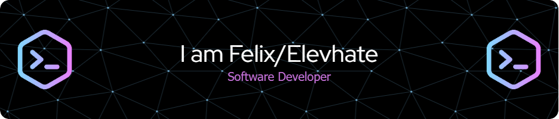

## 🌐 Socials:

# 💻 Tech Stack:

	<code></code>
	<code></code>
	<code></code>
	<code></code>
	<code></code>
	<code></code>
	<code></code>
	<code></code>
	<code></code>
	<code></code>
	<code></code>
	<code></code>

## 🏆 Top Languages

## 🏆 GitHub Trophies

### ✍️ Random Dev Quote
